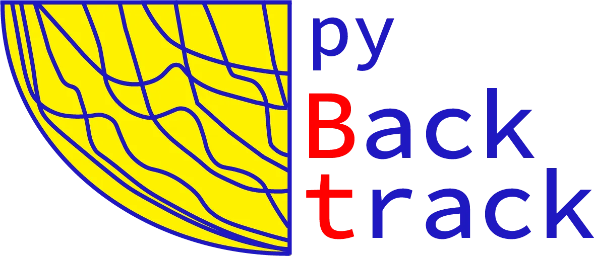

# pyBacktrack_applications

Companion code and data for:

> Müller, R. D., Cannon, J., Williams, S., Dutkiewicz, A., and Wright, N. M.
> **pyBacktrack 1.5: gridded paleobathymetry, well backstripping and gridded
> subsidence-rate analysis.** *Geoscientific Model Development* (in
> preparation, 2026).

This repository contains every figure script, every input dataset and the
helper utilities needed to reproduce the figures in the paper from scratch.
The large external grid set paleobathymetry based on (Zahirovic et al. (2022) 
plate model are fetched by a script rather than committed in tree.

---

## At a glance

| | |
|---|---|
| Figures reproduced | 12 (plus four optional MP4 animations) |
| Input wells        | 109 NW Shelf wells (in `data/wells/`) |
| Input grids ≤100 MB | regional Sandwell VGG, regional D10_gmcm9 dynamic topography (in `data/grids/`) |
| External grids     | Zahirovic 2022 paleobathymetry (fetched on demand) |
| Output format      | PNG + PDF for figures, MP4 for animations |
| Build time         | ~5 min for static figures, ~30 min including data step and videos |

---

## Layout

```
pyBacktrack_applications/
├── README.md              <- this file
├── LICENSE                <- GPL v2 (matches pyBacktrack)
├── requirements.txt       <- pip install path
├── environment.yml        <- conda-forge install path (includes pygplates)
│
├── data/                  <- self-contained inputs
│   ├── README.md          <- per-dataset provenance and licence
│   ├── wells/             <- 109 NW Shelf wells
│   └── grids/
│       ├── vgg_nwshelf.nc <- regional Sandwell V31.1 VGG (Fig 5)
│       └── dynamic_topography/D10_gmcm9/  <- regional Braz 2021 DT (Fig 12)
│
├── scripts/               <- one .py per figure + shared helpers
│   ├── README.md          <- per-figure catalogue, dependencies, runner targets
│   ├── config.py          <- paths and shared constants
│   ├── paleobathy_render.py
│   ├── 01_workflow_flowchart.py  ... 12_dt_maps.py
│   ├── 07a_backstrip_all_nwshelf.py        <- data step (writes rate grids)
│   ├── 10a_make_subsidence_videos.py       <- optional MP4 (subsidence-rate)
│   ├── 12a_dt_video.py                     <- optional MP4 (dynamic topography)
│   ├── run_all_figures.sh                  <- batch runner
│   ├── make_all_videos.sh                  <- video-only batch runner
│   └── fetch_paleobathymetry_grids.sh      <- one-time grid fetch
│
├── tools/
│   └── populate_data.py   <- one-shot helper that populates data/
│
└── figures/output/        <- written by the scripts (gitignored)
```

---

## Quickstart

### 1. Install dependencies

```bash
# Option A: full stack including pygplates (Figs 2, 3 need pygplates).
conda env create -f environment.yml
conda activate pybacktrack-applications

# Option B: pip-only (everything except Figs 2, 3 will work).
pip install -r requirements.txt
```

### 2. Populate `data/` from source

If you cloned this repo from GitHub you already have the wells, the
regional VGG grid and the regional D10_gmcm9 dynamic-topography slices.
You can skip this step.

If you cloned it from the paper-development tree, the `data/grids/`
folder is empty and the wells live elsewhere. Run the populator once:

```bash
python tools/populate_data.py
```

It reads from your local Sandwell V31.1 VGG file
(`/Users/dietmar/grids/vgg_31.1.nc` by default; override with
`--vgg PATH`), the pybacktrack-bundled D10_gmcm9 grids, and the NW Shelf
well directory, then writes region-cropped copies into `data/`.

### 3. (Optional) Fetch the external paleobathymetry grids

Figures 2, 3 and 4 need the paleobathymetry grids; Fig 4 also needs the
Straume 2020 paleobathymetry grids, available here: https://zenodo.org/records/4193576. 
These are not committed because they total several hundred MB.

```bash
cd scripts
./fetch_paleobathymetry_grids.sh mantle     # Zahirovic et al. mantle reference frame
# or
./fetch_paleobathymetry_grids.sh paleomagnetic  # Zahirovic 2022 paleomagnetic frame frame
```

### 4. Build the figures

```bash
cd scripts
./run_all_figures.sh                 # all static figures
./run_all_figures.sh fig09           # specific figure
./make_all_videos.sh                 # opt-in MP4 animations
```

Output PNGs and PDFs land in `figures/output/`. The data step
(`07a_backstrip_all_nwshelf.py`) writes per-well subsidence CSVs and per-
time NetCDF rate grids into `figures/output/nwshelf_subsidence/`; these
are inputs to Figs 9, 10, 11 and 12, and are regenerated only when
missing.

---

## Figure catalogue

| Fig. | Script | Description |
|---|---|---|
| 1 | `01_workflow_flowchart.py` | Paleobathymetry-gridding workflow |
| 2 | `02_north_atlantic_paleobathymetry.py` | LAEA centred on mid-N-Atlantic, 4-panel time series |
| 3 | `03_southern_ocean_paleobathymetry.py` | LAEA south-polar, 4-panel time series with present-day acronyms |
| 4 | `04_pybacktrack_vs_straume_comparison.py` | pyBacktrack 1.5 vs Straume 2020 statistical comparison |
| 5 | `05_nwshelf_map.py` | NW Shelf well-location map on VGG basemap |
| 6 | `06_sl_dt_curves.py` | Sea-level + dynamic-topography time series at the asteras well |
| 7 | `07_backstrip_wells.py` | Asteras backstripping, three configurations |
| 8 | `08_geohistory_wells.py` | Asteras geohistory / Wheeler diagram |
| 9 | `09_rate_timeseries.py` | Margin-scale rate time series (A, B, C = B − A) |
| 10 | `10_rate_maps.py` | 3 × 4 rate-map matrix at four largest |C| times |
| 11 | `11_rate_boxplots.py` | Margin-scale boxplots, 5-Myr intervals |
| 12 | `12_dt_maps.py` | Raw D10_gmcm9 dynamic-topography at the same four times as Fig 10 |
| — | `07a_backstrip_all_nwshelf.py` | Data step: per-well CSVs + per-Myr rate grids |

See `scripts/README.md` for the runner targets, dependencies between
figures, and per-script tunables. LAEA = Lambert Azimuthal Equal-Area projection

---

## Data sources

All input data files are documented in [`data/README.md`](data/README.md)
with provenance, citations and licence terms.

* **Wells**: 109 NW Shelf petroleum exploration wells, originally
  redistributed with the pyBacktrack 1.0 release (Müller et al. 2018,
  *G3*).
* **Vertical gravity gradient**: Sandwell & Smith V31.1, region-cropped
  to `[114°E, 130°E, 20°S, 9°S]` for the NW Shelf basemap.
* **Dynamic topography**: Braz et al. (2021) `D10_gmcm9` model,
  region-cropped to `[109°E, 136°E, 26°S, 4°S]` (Fig 12 region + buffer)
  in 5 Myr time slices covering 0–150 Ma.
* **Sea level**: Haq & Ogg (2024) bundled long-term hybrid curve
  (loaded from the installed pybacktrack package).
* **Paleobathymetry grids**: Zahirovic et al. (2022) mantle frame or
 paleomagnetic frame (default in paper) — fetched at runtime via
  `scripts/fetch_paleobathymetry_grids.sh`.

---

## Citing this work

If you use code or data from this repository in a publication, please
cite the paper (citation block at the top) **and** the original
publishers of each input dataset (see `data/README.md`).

---

## Licence

Code is released under the **GNU General Public License v2**, matching
the licence of pyBacktrack itself; see `LICENSE`. Each input dataset
retains its publisher's licence; see `data/README.md` for per-dataset
terms.
